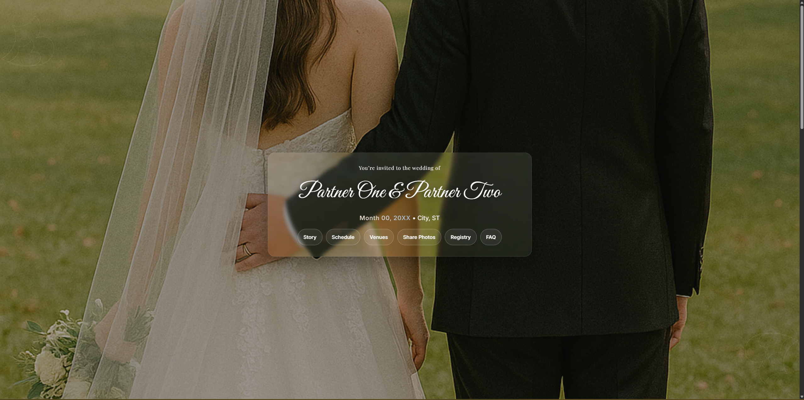
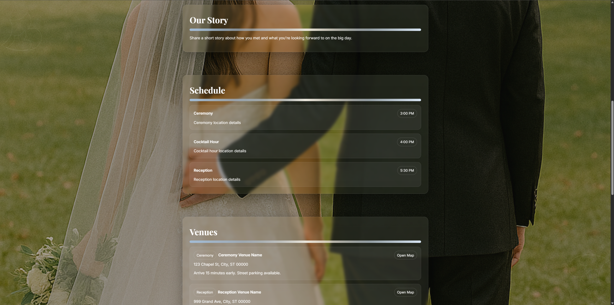
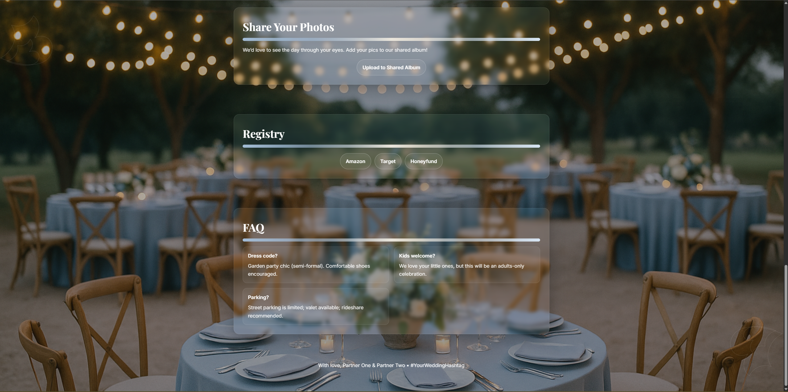

# Eternal Vows -- Wedding Website

Eternal Vows is a customizable, self‑hosted wedding website template for sharing all of your event information in one place. Configure names, date, location, story, schedule, venue details (with map), registry links, FAQs, and optional photo‑sharing links via a simple JSON file—no rebuild required. A lightweight Node + Express server powers a dynamic background slideshow that auto‑refreshes as you add images. Run locally with Node or deploy easily with Docker/Compose.

## Features
- Clean, modern single-page design with elegant typography
- Dynamic background slideshow sourced from `config/photos` (no rebuild required)
- Smooth in-page navigation; external links open in a new tab
- Config-driven content (names, date, venues, schedule, registry, FAQs)

## Site example

Below are screenshots of the default layout to help visualize the sections and spacing:







## Project structure
- `index.html` — UI, styling, and client JS (loads details from `config/config.json`)
- `server.mjs` — Express server and `/api/photos` endpoint
- `config/config.json` — Site content (names, date, venue(s), etc.)
- `config/photos/` — Background slideshow images
- `.github/workflows/docker.yml` — Optional CI to build/push a container image

## Quick start (Node)
Requirements: Node 18+ recommended.

1) Install dependencies

```powershell
npm install
```

2) Start the server

```powershell
npm start
# then open http://localhost:5500
```

Optional: change the port via `PORT` env var (default 5500).

```powershell
$env:PORT=8080; npm start
```

## Configure content
Edit `config/config.json`. All fields are optional; unset sections/buttons are hidden automatically.

- `coupleNames`: Display names for the hero section
- `dateDisplay`: Friendly wedding date string
- `locationShort`: Short city/state line under the date
- `story`: Paragraph for “Our Story”
- `schedule`: Array of items `{ time, title, details }`
- `venues`: Multiple venues (preferred). Use an array `[{...}, {...}]` or a labeled object map.
  - Array form (recommended): each item supports `{ name, address, mapUrl, mapCta, notes, label? }`
  - Object form: keys become labels; values are venue objects, e.g. `{ ceremony: {...}, reception: {...} }`
- `venue`: Legacy single-venue (optional): `{ name, address, mapUrl, mapCta, notes }`
- `photoUpload`: `{ url, label?, text? }` link to your shared album; `text` customizes the paragraph in the section (fallbacks to defaults if omitted)
- `registry`: Array of `{ label, url }`
- `faqs`: Array of `{ q, a }`
- `slideshow`: `{ intervalMs, transitionMs, photoRefreshSeconds, dynamicPhotosUrl }` (defaults work out of the box)
- `ui`: `{ monogram, footerNote, autoRefreshSeconds }`
  - Optional color palette: `ui.colors` or top-level `colors`.
    - Supported keys: `accent1`, `accent2`, `accent3`, `text`, `ink`, `bgOverlay`, `border`, `card`, `maxw`, `blur`.
    - Values are CSS colors or raw CSS for `blur` (e.g., `saturate(140%) blur(6px)`) and unit values for `maxw` (e.g., `1024px`).
  - Background (fallback when photos aren’t visible): `ui.background` or top-level `background`.
    - Keys: `baseTop`, `baseBottom`, `radial1`, `radial2` (CSS colors).
    - Alternate keys also accepted in `ui.colors` for convenience: `bgBaseTop`, `bgBaseBottom`, `bgRadial1`, `bgRadial2` (or kebab-case `bg-base-top`, etc.).
    - Defaults to a warm golden palette if not provided.

Example (default with multiple venues):

```json
{
  "coupleNames": "Partner One & Partner Two",
  "dateDisplay": "Month 00, 20XX",
  "locationShort": "City, ST",
  "story": "Share a short story about how you met...",
  "schedule": [
    { "time": "3:00 PM", "title": "Ceremony", "details": "Ceremony location details" },
    { "time": "4:00 PM", "title": "Cocktail Hour", "details": "Cocktail hour location details" },
    { "time": "5:30 PM", "title": "Reception", "details": "Reception location details" }
  ],
  "venues": [
    { "label": "Ceremony", "name": "St. Mary Church", "address": "1 Church Rd", "mapUrl": "https://maps.google.com/?q=church", "notes": "Street parking available." },
    { "label": "Reception", "name": "The Grand Hall", "address": "999 Party Ave", "mapUrl": "https://maps.google.com/?q=hall", "notes": "Valet on site." }
  ],
  "photoUpload": { "label": "Upload to Shared Album", "url": "https://example.com/album" },
  "registry": [
    { "label": "Amazon", "url": "https://example.com/amazon" },
    { "label": "Target", "url": "https://example.com/target" }
  ],
  "faqs": [ { "q": "Dress code?", "a": "Semi-formal." } ],
  "slideshow": { "dynamicPhotosUrl": "/api/photos", "intervalMs": 6000, "transitionMs": 1200 },
  "ui": {
    "monogram": "You’re invited to the wedding of",
    "footerNote": "With love, ...",
    "colors": {
      "accent1": "#a3bcd6",
      "accent2": "#d7e5f3",
      "accent3": "#f7eddc",
      "text": "#ffffff",
      "ink": "#2b2a2a",
      "bgOverlay": "rgba(20,18,18,0.35)",
      "border": "rgba(255,255,255,0.12)",
      "card": "rgba(255,255,255,0.08)",
      "maxw": "1024px",
      "blur": "saturate(140%) blur(6px)"
    },
    "background": {
      "baseTop": "#2d2616",
      "baseBottom": "#1f1a10",
      "radial1": "rgba(234, 200, 94, 0.45)",
      "radial2": "rgba(255, 239, 189, 0.38)"
    }
  }
}
```

Alternative formats for venues:

Legacy single venue (still supported):

```json
"venue": {
  "name": "Venue Name",
  "address": "123 Main St, City, ST 00000",
  "mapUrl": "https://maps.google.com",
  "mapCta": "Open Map",
  "notes": "Parking and arrival notes."
}
```

Object map (labels from keys):

```json
  "venues": {
    "Ceremony": {
      "name": "Ceremony Venue Name",
      "address": "123 Chapel St, City, ST 00000",
      "mapUrl": "https://maps.google.com/?q=Ceremony+Venue",
      "mapCta": "Open Map",
      "notes": "Arrive 15 minutes early. Street parking available."
    },
    "Reception": {
      "name": "Reception Venue Name",
      "address": "999 Grand Ave, City, ST 00000",
      "mapUrl": "https://maps.google.com/?q=Reception+Venue",
      "mapCta": "Open Map",
      "notes": "Valet available. Dinner served at 6:00 PM."
    }
  },
```

## Photos (background slideshow)
- Put images in `config/photos/`.
- Supported formats: `.jpg`, `.jpeg`, `.png`, `.webp`, `.avif`.
- The browser requests the list from `/api/photos`. The client preloads the first image quickly and crossfades.
- The list auto-refreshes every `slideshow.photoRefreshSeconds` seconds (default 20) to pick up new files.

Tips:
- Use landscape images ≥ 1920×1080 for best results.
- Large images are fine; they’re loaded sequentially in the background.

## Docker
Build a local image and run it. Mount your local `config` directory so you can edit content and photos without rebuilding.

Windows PowerShell:

```powershell
docker build -t ghcr.io/jacoknapp/eternalvows:latest .
docker run --rm -p 5500:5500 -v ${PWD}\config:/app/config ghcr.io/jacoknapp/eternalvows:latest
```

macOS/Linux:

```bash
docker build -t ghcr.io/jacoknapp/eternalvows:latest .
docker run --rm -p 5500:5500 -v "$PWD/config:/app/config" ghcr.io/jacoknapp/eternalvows:latest
```

Optional: change the port with `-e PORT=8080 -p 8080:8080`.

## Docker Compose (optional)
Example `docker-compose.yml` if you prefer compose:

```yaml
services:
  wedding:
    image: ghcr.io/jacoknapp/eternalvows:latest # or build: .
    ports:
      - "5500:5500"
    environment:
      - PORT=5500
    volumes:
      - ./config:/app/config
    restart: unless-stopped
```

## CI (GitHub Actions)
`/.github/workflows/docker.yml` builds a multi-arch image and can push to GHCR (GitHub Container Registry). You can enable Docker Hub pushes by adding a login step and including a docker.io image reference in the metadata step.

## API reference
- `GET /api/photos` → `{ files: ["file1.jpg", "file2.png", ...] }` from `config/photos/`.

## Troubleshooting
- Server exits immediately (code 1):
  - Run `npm install` first to ensure dependencies are present.
  - Check the terminal error message; ensure `config/config.json` is valid JSON.
  - Ensure the `config/` and `config/photos/` folders exist and are readable.
  - Port already in use? Set a different `PORT` or stop the other process.
- Photos don’t appear:
  - Verify images are in `config/photos` with supported extensions.
  - Check `http://localhost:5500/api/photos` returns a list.
  - Open DevTools → Network to see if image requests 404.
- Sharp install issues on Windows:
  - Try `npm install` again; Sharp provides prebuilt binaries for most Node versions.
  - Ensure Node 18+ and a stable internet connection during install.

## Privacy notes
Keep private details out of version control. The provided `config/config.json` has placeholders—replace them locally or configure secrets in your deployment environment.

## Favicons
- All favicon assets live in `/favicon`.
- The primary source icon is `wedding_bell.svg`. If you want the bell larger, edit that SVG (we scale it around center) and then regenerate the raster variants as needed.
- This site already references: SVG, ICO, PNG sizes (16–256), Apple Touch (76–180), and `site.webmanifest`.
